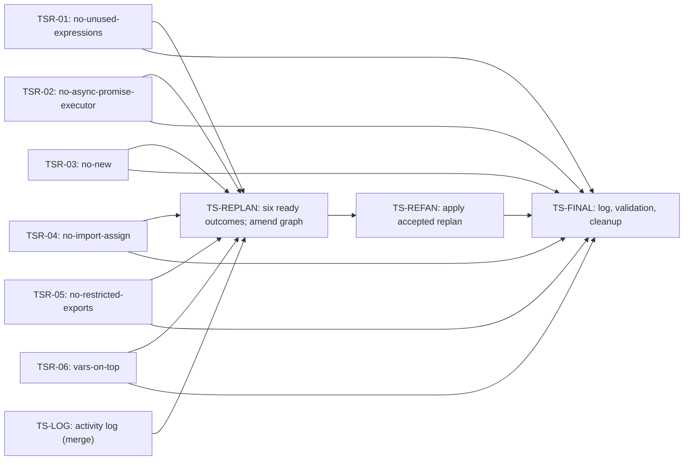

# ESLint TypeScript rules: inventory and initial fan-out plan

**Revision 2 for review (2026-09-12), applying Jeremy Carroll's late feedback.** Improve core-rule behavior on TypeScript syntax in `1000lines/eslint`, starting with six independently reviewable rule changes. The source survey covers **292 rules and 35 eligible candidates**. This initial DAG commissions **10 nodes, 15 hard edges and six parallel rule lanes**; 29 additional candidates remain uncommissioned until the required checkpoint. It does not promise forty PRs or full inventory completion within the event.

Project: `eslint-ts-rules`; color `pink`; repository `1000lines/eslint`; branch/PR base `main`; human lead Jeremy Carroll / `jeremycarroll`. Seed: [100-119](https://linear.app/1000lines/issue/100-119/plan-project-seed-ticket). Selected branch base: `main@4f6a3cc87297ee83a06767d5a492c41cd521abfb` (PR #3 merged). Rule-source snapshot remains `3d8a6128e70d2f641697d5ebbfd107f02fa1f671`; the intervening merge changes planning files only.

## Human amendment and accepted scope

Jeremy [approved revision 1](https://github.com/1000lines/eslint/pull/3#pullrequestreview-5188415501) and merged PR #3, accepting the six-lane count. His subsequent [late review](https://github.com/1000lines/eslint/pull/3#issuecomment-5649230270) and reactivation of 100-119 require excluding `no-redeclare` and `no-unused-vars`, whose upstream PRs are already assigned, and dropping CI narrowing because the observed matrix latency does not justify a setup gate. Repository permission readback confirms Jeremy has admin access. This decision supersedes revision 1 D1/D6, the original brief/project CI-narrowing-and-widening clauses, and requirements/design AC4–AC5 wherever they require those configuration nodes. The earlier source documents remain historical inputs; generated tickets must apply this amendment.

Replace TSR-02/03 with existing inventory candidates C-11 `no-async-promise-executor` and C-15 `no-new`. They have reproduced gaps, small independent selector changes and separate rule/test/doc trios; neither needs the shared `couldBeError`/`isConstant` work reserved for replan. Keep six lanes and the review checkpoint. Remove TS-CI-N and TS-CI-W: full CI is required from the first lane, and TS-FINAL directly requires each surviving lane's merge plus full validation of composed main. This trades away the configuration-only optimization while eliminating its prerequisite latency; it does not waive a check or modify a workflow.

No downstream nodes have been created. Reuse the explicitly reopened **100-119 → 100-120** planning/fan-out pair for this revision; do not create duplicate seeds or implementation tickets here. TSR-02/03 are unissued plan keys, so replacing their proposed contents does not retarget an existing issue. C-11/C-15 are retired reservation aliases. Before fan-out, pin the accepted revision 2 SHA and reconcile current feedback; revision 1 acceptance alone no longer authorizes its obsolete payloads.

## Read and review boundaries

- [Candidate inventory, method and first-wave evidence](eslint-ts-rules/100-119-rule-inventory.md), including [reserved candidates C-16–C-31](eslint-ts-rules/100-119-reserved-candidates.md).
- Per-rule exclusion ledgers: [A–M](eslint-ts-rules/100-119-exclusions-a-m.md), [N](eslint-ts-rules/100-119-exclusions-n.md), [O–Z](eslint-ts-rules/100-119-exclusions-o-z.md). Every registry rule has one disposition; “no demonstrated gap” is not a compatibility certification.
- [Delivery contract](eslint-ts-rules/100-119-delivery-contract.md): exact non-rule ownership, per-node required actions/acceptance, validation arrays, CI check identities, review, replan, log and cleanup. These instructions and the relevant inventory entry must be copied into generated tickets, not replaced by a link-only generic body.
- [Standalone Mermaid graph](fan-out-plan-100-119-eslint-ts-rules.mmd), identical to the graph below. Graph diffs are the topology review unit.

This ticket edits only these planning artifacts. It creates no downstream issues, rule changes, CI configuration, activity log or workflow infrastructure. 100-118's requirements PR [#2](https://github.com/1000lines/eslint/pull/2) is merged and its issue is Done. Reuse the existing [100-120 fan-out trigger](https://linear.app/1000lines/issue/100-120/trigger-fan-out); do not create another trigger or design seed. The project currently has only those three seeds, so no finalizer exists to reuse. After plan acceptance, 100-120 creates exactly the 10 manifest nodes, then activates only after staged metadata and relation readbacks. The six-lane count is accepted; this revised selection/topology requires normal revised-plan review before fan-out.

## Decomposition and size

<!-- prettier-ignore -->
| Alternative | Assessment |
| --- | --- |
| One PR for all TypeScript support | Violates one-rule ownership, mixes many checks and makes review/cancellation expensive. Rejected. |
| One sequential rule chain | No shared files require ordering between the six lanes; it wastes genuine parallelism. Rejected. |
| Commission all 35 eligible candidates immediately | Overcommits review capacity and speculative shared-helper boundaries before the required checkpoint. Keep the inventory, defer those tickets. |
| Six independent rule lanes plus log/replan/finalization | Selected. Covers expression dispatch, Promise executors, discarded constructors, import/export syntax and namespace scope; exposes varied risks while keeping every implementation diff disjoint. |

<!-- prettier-ignore -->
| Node | Scope / exact ownership | Estimated additions / deletions | Files |
| --- | --- | --- | --- |
| TS-LOG | `hackathon/1000lines--eslint.md` | +80–140 / 0 | 1 |
| TSR-01 | `no-unused-expressions` rule/test/doc | +60–110 / -0–5 | 3 |
| TSR-02 | `no-async-promise-executor` rule/test/doc | +70–130 / -5–15 | 3 |
| TSR-03 | `no-new` rule/test/doc | +60–110 / -5–10 | 3 |
| TSR-04 | `no-import-assign` rule/test/doc | +120–220 / -10–30 | 3 |
| TSR-05 | `no-restricted-exports` rule/test/doc | +140–260 / -5–20 | 3 |
| TSR-06 | `vars-on-top` rule/test/doc | +100–200 / -5–20 | 3 |
| TS-REPLAN | New `first-wave-replan.md`, `.mmd`; activity log handoff | +250–500 / -0–80 | 3 |
| TS-REFAN | `first-wave-refanout.md`; accepted Linear mutations | +100–200 / -0–30 | 1 |
| TS-FINAL | `final-reconciliation.md`; activity log handoff | +140–260 / -0–40 | 2 |

All abbreviated rule trios expand to the exact paths in the inventory; other plan/report paths are under `docs/symphony-plans/eslint-ts-rules/`. Estimates describe expected diff size, not quotas. The replacement lanes need no fixes, suggestions or new options. Preserve each single-rule boundary; if implementation reveals a shared dependency or type requirement, replan instead of broadening ownership. No new project-local infrastructure is budgeted.

## Decisions

<!-- prettier-ignore -->
| Decision | Choice, rationale, source and enforcing owner |
| --- | --- |
| D1 — Six-lane checkpoint (O1) | Retain the six-lane count accepted by Jeremy on PR #3; replace the two upstream-owned rules with C-11/C-15 per the human amendment. Review the revised selection before 100-120 fan-out. TS-REPLAN owns subsequent changes. |
| D2 — Staged commissioning | The other 29 candidates are evidence-backed reservations, not Linear payloads. Select more through TS-REPLAN/TS-REFAN according to capacity and discovered shared behavior. This is scheduling policy, not invented rule-to-rule dependencies. |
| D3 — Syntax-only correction | Preserve options/JS semantics and use AST/parser scope metadata. Type-dependent lanes are canceled. Rule owners enforce this; TS-REPLAN records boundary changes. Historical reference options do not override the explicit no-options exclusion. |
| D4 — Disjoint first wave | One exact rule/test/doc trio per lane; no shared utility/type/index/config/log edits. Shared helper needs are handled by a later accepted prerequisite owner, not duplicated or silently shared. Inventory and TS-REPLAN enforce this. |
| D5 — Selected base | All branches and PRs use main; hard edges control dispatch/evidence only. No predecessor commits absent from main. Hosted Symphony branch/title rules supersede historical `ts/<rule>` conventions, as recorded in the accepted design. Every task owner enforces. |
| D6 — Full CI throughout | Jeremy's [late review](https://github.com/1000lines/eslint/pull/3#issuecomment-5649230270) removes narrowing and its now-unnecessary widening node. Every lane requires the full existing CI workloads; TS-FINAL verifies composed main. No configuration/setup task gates lane dispatch, no workflow changes, and empty requiredChecks never means green. The delivery contract records concrete check identities. |
| D7 — Review and merge are distinct | `TSR-*` → TS-REPLAN needs current-head normal readiness (mature) or a recorded terminal outcome to amend; `TSR-*` → TS-FINAL needs surviving lane merges. Review does not prove main contains the code. The dependent worker enforces the stronger condition even if a mature blocker enables dispatch. |
| D8 — Single log writer at a time | TS-LOG → TS-REPLAN → TS-REFAN → TS-FINAL orders log ownership handoffs; rule workpads are event inputs. Source: required hackathon log. No shared log edits on parallel rule branches. |
| D9 — Finalizer follows the latest graph | TS-REFAN updates TS-FINAL's hard blockers/checklist before activating new nodes. Preserve full CI, unresolved defects and any seam cleanup in the amended graph. TS-FINAL cannot accept the project using this initial six-lane horizon after expansion. |
| D10 — Clean stop and review cutoff | Verify the event date/timezone and credentials; preserve exact state/reason/owner on revocation. A clean early stop does not prove finalization or waive full CI/review. TS-FINAL records evidence; Jeremy owns acceptance. |
| D11 — Exclusion policy | Defer deprecated rules to conserve current-rule review capacity. Existing TS coverage or no demonstrated gap does not warrant a new lane. Frozen nondeprecated rules can receive commissioned fork fixes; no upstream contribution is implied. Exclude no-redeclare/no-unused-vars for existing upstream ownership per the human amendment, even though their fork gaps remain reproducible. Only an explicit later human decision can recommission those rules. Inventory review can revise other exclusions. |
| D12 — Fail closed at fan-out | Resolve actual labels, states, identities, accepted SHAs and targets; render, inspect and read back exact direct relations. Missing labels are routine setup when existing permissions allow creation. Otherwise stop dependent writes and record actual failures. 100-120 and TS-REFAN enforce. |

## DAG

The graph starts with six independent rule lanes and an independent activity-log task. No setup node gates a lane. The review checkpoint and re-fan-out feed final reconciliation; separate lane-to-finalizer edges require merged results. The longer paths have four nodes. No join-only task or branch is introduced.



All arrows are direct hard blocker relations. Detailed satisfaction conditions below distinguish readiness from merged-base requirements. The direct finalizer edges enforce merge evidence that the review checkpoint does not require. No additional sequencing blockers are authorized.

## DAG manifest

This is the single machine-readable manifest for the initial graph. Defaults are staging defaults; 100-120 creates Backlog nodes first, verifies all payloads and relations, then may activate the accepted graph. `mature` remains a blocker label with the current-head gate described in the delivery contract. It does not satisfy explicitly required merges.

```yaml
schema: symphony-dag-manifest/v1
project:
    code: eslint-ts-rules
    color: pink
    base_branch: main
    human_lead: Jeremy Carroll
    human_lead_github: jeremycarroll
    linear_issue_labels: [pink]
    github_pr_labels: [symphony, pink]
defaults:
    initial_state: Backlog
    maturity_label: mature
    task_branch_base: main
    task_pr_base: main
    task_pr_draft: true
    issue_assignee: Jeremy Carroll
    pr_assignee: jeremycarroll
    edge_semantics: direct blockers; dependent ticket enforces its stated readiness or merged-main condition
    relation_type: blocks
    mutation_policy: preflight and stage; read back all issue IDs and direct relations before activation
nodes:
    - id: TS_LOG
      payload_key: TS-LOG
      title: Initialize repository activity log
      type: task
      difficulty: easy
      labels: [pink]
      branch:
          {
              template: "symphony/eslint-ts-rules/${issue}/activity-log",
              base: main,
              birth: on_dispatch,
          }
      pr:
          {
              create: on_branch_birth,
              base: main,
              draft: true,
              labels: [symphony, pink],
          }
    - id: TSR_01
      payload_key: TSR-01
      title: Support TS syntax in no-unused-expressions
      type: task
      difficulty: easy
      labels: [pink]
      branch:
          {
              template: "symphony/eslint-ts-rules/${issue}/no-unused-expressions",
              base: main,
              birth: on_dispatch,
          }
      pr:
          {
              create: on_branch_birth,
              base: main,
              draft: true,
              labels: [symphony, pink],
          }
    - id: TSR_02
      payload_key: TSR-02
      title: Support TS syntax in no-async-promise-executor
      type: task
      difficulty: easy
      labels: [pink]
      branch:
          {
              template: "symphony/eslint-ts-rules/${issue}/no-async-promise-executor",
              base: main,
              birth: on_dispatch,
          }
      pr:
          {
              create: on_branch_birth,
              base: main,
              draft: true,
              labels: [symphony, pink],
          }
    - id: TSR_03
      payload_key: TSR-03
      title: Support TS syntax in no-new
      type: task
      difficulty: easy
      labels: [pink]
      branch:
          {
              template: "symphony/eslint-ts-rules/${issue}/no-new",
              base: main,
              birth: on_dispatch,
          }
      pr:
          {
              create: on_branch_birth,
              base: main,
              draft: true,
              labels: [symphony, pink],
          }
    - id: TSR_04
      payload_key: TSR-04
      title: Support TS syntax in no-import-assign
      type: task
      difficulty: hard
      labels: [pink]
      branch:
          {
              template: "symphony/eslint-ts-rules/${issue}/no-import-assign",
              base: main,
              birth: on_dispatch,
          }
      pr:
          {
              create: on_branch_birth,
              base: main,
              draft: true,
              labels: [symphony, pink],
          }
    - id: TSR_05
      payload_key: TSR-05
      title: Support TS syntax in no-restricted-exports
      type: task
      difficulty: easy
      labels: [pink]
      branch:
          {
              template: "symphony/eslint-ts-rules/${issue}/no-restricted-exports",
              base: main,
              birth: on_dispatch,
          }
      pr:
          {
              create: on_branch_birth,
              base: main,
              draft: true,
              labels: [symphony, pink],
          }
    - id: TSR_06
      payload_key: TSR-06
      title: Support TS syntax in vars-on-top
      type: task
      difficulty: easy
      labels: [pink]
      branch:
          {
              template: "symphony/eslint-ts-rules/${issue}/vars-on-top",
              base: main,
              birth: on_dispatch,
          }
      pr:
          {
              create: on_branch_birth,
              base: main,
              draft: true,
              labels: [symphony, pink],
          }
    - id: TS_REPLAN
      payload_key: TS-REPLAN
      title: Replan after six lanes reach review
      type: replan
      difficulty: hard
      labels: [pink]
      branch:
          {
              template: "symphony/eslint-ts-rules/${issue}/first-wave-replan",
              base: main,
              birth: on_dispatch,
          }
      pr:
          {
              create: on_branch_birth,
              base: main,
              draft: true,
              labels: [symphony, pink],
          }
    - id: TS_REFAN
      payload_key: TS-REFAN
      title: Apply accepted first-wave replan
      type: fanout
      difficulty: hard
      labels: [pink]
      branch:
          {
              template: "symphony/eslint-ts-rules/${issue}/first-wave-refanout",
              base: main,
              birth: on_dispatch,
          }
      pr:
          {
              create: on_branch_birth,
              base: main,
              draft: true,
              labels: [symphony, pink],
          }
    - id: TS_FINAL
      payload_key: TS-FINAL
      title: Reconcile delivery and clean stopping state
      type: finalize
      difficulty: hard
      labels: [pink]
      branch:
          {
              template: "symphony/eslint-ts-rules/${issue}/final-reconciliation",
              base: main,
              birth: on_dispatch,
          }
      pr:
          {
              create: on_branch_birth,
              base: main,
              draft: true,
              labels: [symphony, pink],
          }
edges:
    - { from: TSR_01, to: TS_REPLAN }
    - { from: TSR_02, to: TS_REPLAN }
    - { from: TSR_03, to: TS_REPLAN }
    - { from: TSR_04, to: TS_REPLAN }
    - { from: TSR_05, to: TS_REPLAN }
    - { from: TSR_06, to: TS_REPLAN }
    - { from: TSR_01, to: TS_FINAL }
    - { from: TSR_02, to: TS_FINAL }
    - { from: TSR_03, to: TS_FINAL }
    - { from: TSR_04, to: TS_FINAL }
    - { from: TSR_05, to: TS_FINAL }
    - { from: TSR_06, to: TS_FINAL }
    - { from: TS_LOG, to: TS_REPLAN }
    - { from: TS_REPLAN, to: TS_REFAN }
    - { from: TS_REFAN, to: TS_FINAL }
```

## Branch manifest

The concrete template for every task branch is below. All entries use **branch base main, PR base main, birth on dispatch, draft PR on branch birth** (an independent dependency-note draft is allowed). They become ready only after the common current-SHA validation/review/feedback gate. There are no omitted task PRs. Replace `${issue}` only with that node’s actual Linear identifier. The planning branch is `symphony/eslint-ts-rules/100-119/review-amendments`, also based on and targeting main.

<!-- prettier-ignore -->
| Node | Branch template |
| --- | --- |
| TS-LOG | `symphony/eslint-ts-rules/${issue}/activity-log` |
| TSR-01 | `symphony/eslint-ts-rules/${issue}/no-unused-expressions` |
| TSR-02 | `symphony/eslint-ts-rules/${issue}/no-async-promise-executor` |
| TSR-03 | `symphony/eslint-ts-rules/${issue}/no-new` |
| TSR-04 | `symphony/eslint-ts-rules/${issue}/no-import-assign` |
| TSR-05 | `symphony/eslint-ts-rules/${issue}/no-restricted-exports` |
| TSR-06 | `symphony/eslint-ts-rules/${issue}/vars-on-top` |
| TS-REPLAN | `symphony/eslint-ts-rules/${issue}/first-wave-replan` |
| TS-REFAN | `symphony/eslint-ts-rules/${issue}/first-wave-refanout` |
| TS-FINAL | `symphony/eslint-ts-rules/${issue}/final-reconciliation` |

## Linear Relation Payloads

For every row, resolve the source key to its freshly read back issue UUID and emit exactly `{"issueId":"<blocker UUID>","relatedIssueId":"<blocked UUID>","type":"blocks"}`. `issueId` is the blocker; `relatedIssueId` is the blocked ticket. These symbolic keys are not fabricated issue IDs. No relation mutation is authorized in 100-119.

<!-- prettier-ignore -->
| Source edge | issueId (blocker key) | relatedIssueId (blocked key) | type |
| --- | --- | --- | --- |
| `TSR_01 → TS_REPLAN` | `TSR-01` | `TS-REPLAN` | `blocks` |
| `TSR_02 → TS_REPLAN` | `TSR-02` | `TS-REPLAN` | `blocks` |
| `TSR_03 → TS_REPLAN` | `TSR-03` | `TS-REPLAN` | `blocks` |
| `TSR_04 → TS_REPLAN` | `TSR-04` | `TS-REPLAN` | `blocks` |
| `TSR_05 → TS_REPLAN` | `TSR-05` | `TS-REPLAN` | `blocks` |
| `TSR_06 → TS_REPLAN` | `TSR-06` | `TS-REPLAN` | `blocks` |
| `TSR_01 → TS_FINAL` | `TSR-01` | `TS-FINAL` | `blocks` |
| `TSR_02 → TS_FINAL` | `TSR-02` | `TS-FINAL` | `blocks` |
| `TSR_03 → TS_FINAL` | `TSR-03` | `TS-FINAL` | `blocks` |
| `TSR_04 → TS_FINAL` | `TSR-04` | `TS-FINAL` | `blocks` |
| `TSR_05 → TS_FINAL` | `TSR-05` | `TS-FINAL` | `blocks` |
| `TSR_06 → TS_FINAL` | `TSR-06` | `TS-FINAL` | `blocks` |
| `TS_LOG → TS_REPLAN` | `TS-LOG` | `TS-REPLAN` | `blocks` |
| `TS_REPLAN → TS_REFAN` | `TS-REPLAN` | `TS-REFAN` | `blocks` |
| `TS_REFAN → TS_FINAL` | `TS-REFAN` | `TS-FINAL` | `blocks` |

### Direct dependency conditions

- **Each TSR → TS-REPLAN:** actual current-head ready/mature review evidence, or recorded terminal cancellation needing graph amendment. The checkpoint examines real review outcomes before all merges are required.
- **Each TSR → TS-FINAL:** the surviving rule change must be merged to main. Maturity alone is insufficient. A cancellation requires an accepted amended disposition before finalization; record a clean early stop if necessary. These edges carry a stronger condition than the review-evidence path through TS-REPLAN.
- **TS-LOG → TS-REPLAN:** log merged and shared file handed off.
- **TS-REPLAN → TS-REFAN:** amended plan accepted and merged, with exact graph and ownership.
- **TS-REFAN → TS-FINAL:** fan-out readbacks and updated finalizer blockers completed; mapping artifact merged.

## Fan-out preflight and failure behavior

100-120 reads the accepted current plan SHA and human decision on the revision 2 selection/topology before mutation. Confirm repository/base, project metadata/color, lead mapping, team states and labels from current APIs. Reuse the existing seeds; only the 10 payload nodes are new. Resolve all required GitHub label definitions before Linear issue/relation writes; create absent `symphony,pink` definitions with existing permissions, read them back, and never overwrite unrelated labels. Resolve Linear `pink`, `mature`, and `wake:15m` plus Backlog/Active/Inactive/Unhappy/Evaluating/terminal state IDs.

Reuse `$SYMPHONY_TOOLING_ROOT/tools/symphony-dag/` functions `parseProjectPlan`, `parseRelationPayloadTable` and `buildDagLinearPayloadFromMarkdown`. Verify graph/manifest/standalone identity, acyclicity, exact edge/table parity, unique rule ownership and the single manifest before writing. The shared builder supplies metadata/payloads; preserve the full applicable inventory and delivery-contract scope in each actual ticket body. Do not install a project-local parser, review runner or fan-out tool.

Stage issues in Backlog and persist actual returned IDs. After all targets resolve, produce/read back exactly the 15 directed relations in both directions, then activate the accepted nodes. Existing hard seed relation 100-119 → 100-120 stays unchanged and is not a new payload. If a create/timeout has ambiguous results, reread and reuse the actual object; do not duplicate or claim rollback. Missing/unreadable required sources, unresolved metadata/labels/state/assignee, ambiguous IDs, stale/unaccepted SHAs, relation direction mismatches or denied writes stop the dependent step. Record the exact failure and named resumption action in the pinned Codex workpad; use Inactive for human access/decision and retain Active for unfinished hard dependencies. Do not continue partial activation.

PR publishing must verify labels, body, selected base, head and assignment. Missing/pending CI is Unhappy + wake:15m; failure is Active; all required CI passing is Inactive for actual review. Fail-closed review/maturity and cutoff handling are copied from the delivery contract. No generated join artifacts, alternate branch ancestry, inferred blockers or unreviewed implementation tickets are permitted.

## Source ledger

<!-- prettier-ignore -->
| Source | Readable input and use |
| --- | --- |
| [Confirmed brief supplied by Jeremy](https://linear.app/1000lines/issue/100-119/plan-project-seed-ticket#comment-0b0b97d2-a1ee-4c29-b663-fd8988b16960) | Authenticated attachment download/read, 2026-09-12; SHA-256 `edaafdaa2562b8b9932674d99d4494da600a1df12fafea8f78dd949d57f5471a`. Resolves the nonportable `../eslint-project-description.md` path. |
| [Owning Linear project](https://linear.app/1000lines/project/eslint-core-rules-typescript-syntax-awareness-0b1144238612) | Complete content and metadata, read through injected GraphQL. Supplies resolved pink/repository metadata where the attachment has placeholders. |
| [Accepted requirements/design](eslint-ts-rules/requirements-and-design.md) | Merged via PR #2; scope, validation, log and clean-stop contract, subject to the explicit human amendment above. |
| [Jeremy’s CI decision](https://github.com/1000lines/eslint/pull/2#issuecomment-5648910128) | Repository admin identity verified; confirms no configured fork CI gate. Does not waive actual workflow validation. |
| [Late human review](https://github.com/1000lines/eslint/pull/3#issuecomment-5649230270) and [earlier approval](https://github.com/1000lines/eslint/pull/3#pullrequestreview-5188415501) | Read submitted reviews, conversation/inline comments, thread state and Linear reactivation; verified Jeremy's admin permission. Governs revision 2 and supersedes the original CI/selection clauses. |
| [Upstream #19563](https://github.com/eslint/eslint/pull/19563), [#19812](https://github.com/eslint/eslint/pull/19812) | Public GitHub API read on 2026-09-12 confirms open PRs by snitin315 and Tanujkanti4441, respectively; excluded from this project. |
| [Tracking issue #19173](https://github.com/eslint/eslint/issues/19173) | Motivation and historical rule leads; not treated as the fork inventory. |
| [max-params #19557](https://github.com/eslint/eslint/pull/19557), [no-shadow #19565](https://github.com/eslint/eslint/pull/19565), [no-useless-constructor #19535](https://github.com/eslint/eslint/pull/19535) | Primary historical lane patterns and current fork equivalents; their option additions and branch names do not expand this project’s accepted scope. |
| [Contribution guidance](https://eslint.org/docs/latest/contribute/pull-requests) and local AGENTS/CLAUDE/CONTRIBUTING/AI policy | One-rule review shape, tests/docs, Conventional Commits and disclosure, subject to explicit fork Symphony requirements. |
| [Hackathon README](https://github.com/1000lines/symphony-client-template/blob/main/hackathon/README.md), [log template](https://github.com/1000lines/symphony-client-template/blob/main/hackathon/repo-log-template.md) | Canonical raw files read; hashes `768392a719196edcca24540929c02033c87ce858c51dec3250e51b8b608cc19a` and `40570d09dd91c1883bb94bf3b4e9efb6991a58e98ee32541c50cead0c2add8c8`. Event/timezone remains an execution input. |
| Selected-base repository sources | Rule registry, source/test/doc trios, helpers, README, SYMPHONY/config, package/toolchain/formatting files, Makefile, check-rule-examples, PR template, CI/docs/client workflows and review context. Inventory has individual source references. |
| Shared workflow/planning/review/proof | `$SYMPHONY_TOOLING_ROOT=/opt/symphony/src/example-repo`, revision `c5c36da145f169dc4d1f223a470727784f140ff6`: runtime WORKFLOW, fan-out schema/criteria, DAG sources/fixture, proof/PR/review guidance; installed repository, Linear, coding, proof and replan skills. The issue explicitly authorizes this replacement for its relative shared-workflow path. |

## Acceptance and handoff

Human review must accept the inventory/exclusions, six-lane selection and DAG before fan-out. Mechanical validation checks the exact graph/manifest/payload sets, ownership, source links, staging and branch policy. The workpad records actual native validation, any Docker fallback, graph render and current-head CI/review status; this plan is not itself evidence of future implementation, deployment or acceptance.

Finalization requires all surviving lanes merged and full composed-main CI passing, all work from the latest accepted graph reconciled through TS-FINAL, the activity log delivered, mandatory feedback and project-introduced seams accounted for, and no unexplained Active ticket or draft PR. Stopped/incomplete work is recorded with its owner and next action; human acceptance alone makes it complete.
